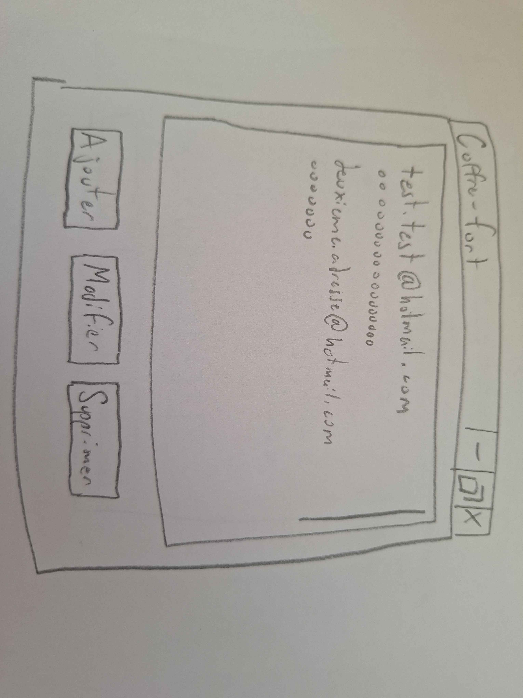
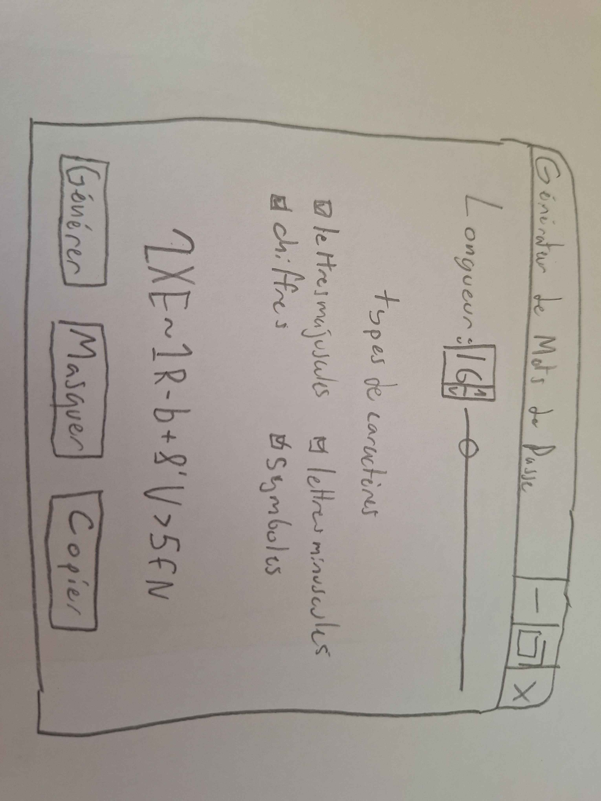

# TP1_2537052

Ce projet permet à l'utilisateur de générer des mots de passe à l'aide d'une interface en lignes de commande.
Il est possible de changer les caractéristiques des mots de passe générés, comme :
* La longueur du mot de passe.
* Les types de caractère contenu dans le mot de passe.
* Vérifier que le mot de passe contient au moins un de chaque type de caractère spécifié.

## Utilisation

Dans le terminal, simplement écrire `python main.py` pour générer un mot de passe.

- Pour déterminer la longueur, ajouter à la fin `-l=[longueur]` ou `--length=[longueur]`.
- Pour filtrer les types de caractères, ajouter à la fin :  
  - `-nl` ou `--no-lower` pour filtrer les lettres minuscules.
  - `-nu` ou `--no-upper` pour filtrer les lettres majuscules.
  - `-nd` ou `--no-digits` pour filtrer les chiffres.
  - `-ns` ou `--no-symbols` pour filtrer les symboles.
- Pour assurer que le mot de passe contiendra au moins un de chaque type de caractère spécifié, ajouter à la fin
`-v` ou `--validate`

### Exemples
  
- Mot de passe de 10 caractères :  
`python main.py --length=10`
- Mot de passe sans lettres :  
`python main.py --no-lower --no-upper`
- Mot de passe contenant un caractère de chaque type :  
`python main.py -l=4 --validate`

## Maquettes

### Coffre-fort

### Générateur de mot de passe
